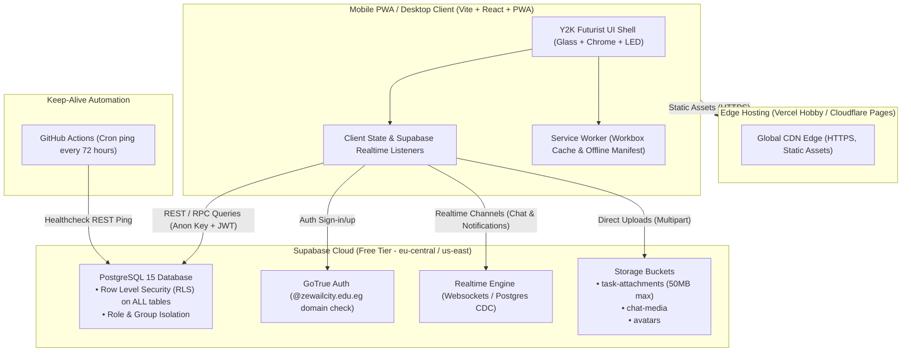
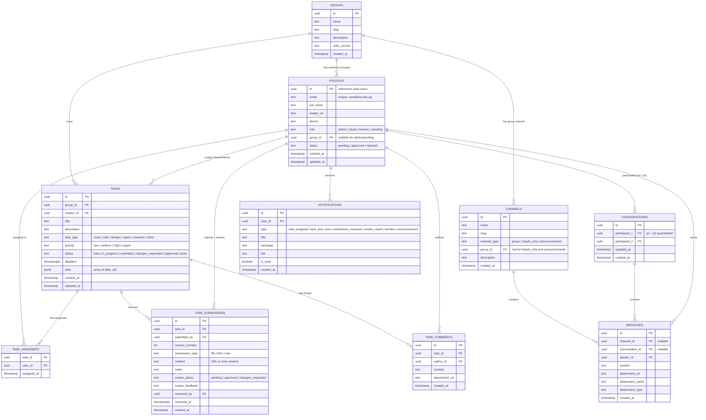

# PROJECT MASTER PLAN: ZC FORMULA STUDENT PWA (PitLane / Telemetry Workspace)

**Version:** 1.0.0-draft  
**Target Organization:** Zewail City Formula Student Racing Team  
**Design Theme:** Y2K Futurism (Motorsport Telemetry x Frutiger Aero Chrome)  
**Primary Constraints:** 100% Free Tiers (Zero Credit Card Required), Mobile-First PWA, Domain-Restricted Auth (`@zewailcity.edu.eg`), Strict Database-Level RLS.

---

## 1. Stack Selection & Free-Tier Verification (Zero Card Required)

Every component of this stack has been verified to be **100% free with NO credit card required** at signup or runtime:

| Layer | Technology | Free-Tier Limits & Terms | Credit Card? | Rationale / Justification |
| :--- | :--- | :--- | :--- | :--- |
| **Frontend & PWA** | **Vite + React 18 + TypeScript + Tailwind CSS** with `vite-plugin-pwa` (Workbox) | Completely free, open source. Client-side static build with service worker caching. | **None** | Leanest possible bundle, instant builds, zero SSR cold starts, full offline PWA service worker control, flawless mobile touch performance. |
| **Styling & UI** | **Tailwind CSS v3 + Lucide Icons + Google Fonts** (Orbitron, Exo 2, Share Tech Mono) | Open source, zero cost. Google Fonts loaded via CSS with local fallbacks. | **None** | Custom design tokens for frosted glass, chrome gradients, neon telemetry LEDs, and responsive bottom bar. |
| **Backend & DB** | **Supabase Free Tier** (PostgreSQL 15 + PostgREST + GoTrue Auth + Realtime + Storage) | • **Database:** 500 MB Postgres storage<br>• **Bandwidth:** 5 GB/month<br>• **Storage:** 1 GB file storage (max 50 MB/file)<br>• **Realtime:** 200 concurrent connections, 2M messages/month<br>• **Auth:** 50,000 monthly active users<br>• **Auto-pause:** Free projects pause after 7 days of inactivity (solved via free keep-alive ping). | **NO card required** (verified on Supabase standard free signup) | Provides full enterprise Postgres with declarative Row Level Security (RLS), instant websockets for realtime chat, and secure asset buckets in one cohesive platform. |
| **Project Keep-Alive** | **GitHub Actions Scheduled Workflow** | 2,000 free runner minutes/month on public or private repos. | **None** | Runs a simple REST API health-check ping against Supabase once every 3 days so the free database never pauses. |
| **Hosting & CI/CD** | **Vercel Hobby** (or **Cloudflare Pages**) | • Vercel: 100 GB bandwidth, unlimited deployments, custom domain, automatic HTTPS.<br>• Cloudflare Pages: unlimited requests, 500 builds/month. | **NO card required** (both allow free GitHub-based login without card) | Instant global edge CDN, zero-config single page app routing, automatic previews per commit. |
| **Auth Domain Control** | **PostgreSQL Trigger on `auth.users`** | Built into database; rejects any email not ending in `@zewailcity.edu.eg`. | **None** | Guaranteed server-side domain enforcement that cannot be bypassed by client manipulation. |
| **Notifications** | **Supabase Realtime Postgres Changes** (In-App) + Web Push API (Phase 3/4) | In-app realtime notifications are 100% free. Web Push uses standard browser VAPID (zero external service cost). | **None** | Delivers instant task alerts, review feedback, and chat notifications directly in the mobile UI. |

---

## 2. System Architecture & High-Level Topology



---

## 3. Data Model & Entity-Relationship Diagram (ERD)

The database enforces all business logic, relationships, and domain restrictions at the PostgreSQL layer.



### Table Definitions & Key Constraints

1. **`groups`**:
   - Fixed 5 Formula Student sub-teams seeded on launch:
     1. `Technical - Vehicle Dynamics` (`vehicle-dynamics`)
     2. `Technical - Aerodynamics` (`aerodynamics`)
     3. `Technical - Low-Voltage Electronics` (`electronics`)
     4. `Technical - Powertrain & Drivetrain` (`powertrain`)
     5. `Operations - Business, Cost & Marketing` (`business-ops`)
2. **`profiles`**:
   - `id`: UUID primary key, 1-to-1 foreign key to `auth.users(id) ON DELETE CASCADE`.
   - `email`: Constraint check `email LIKE '%@zewailcity.edu.eg'`.
   - `role`: Enum check `role IN ('admin', 'head', 'member', 'pending')`. Default `'pending'`.
   - `status`: Enum check `status IN ('pending', 'approved', 'rejected')`. Default `'pending'`.
   - `group_id`: Foreign key to `groups(id)`. Allowed null ONLY when `role IN ('admin', 'pending')`.
3. **`tasks`**:
   - `status`: Enum check `status IN ('todo', 'in_progress', 'submitted', 'changes_requested', 'approved', 'done')`.
   - `priority`: Enum check `priority IN ('low', 'medium', 'high', 'urgent')`.
   - `task_type`: Enum check `task_type IN ('read', 'code', 'design', 'report', 'research', 'other')`.
4. **`task_assignees`**: Composite primary key `(task_id, user_id)`.
5. **`task_submissions`**: Tracks revision history with auto-incrementing `version_number` per task.
6. **`task_comments`**: Realtime discussion thread scoped to the task.
7. **`channels`**:
   - 5 group channels (one per group).
   - 1 `heads_only` channel (accessible ONLY to Group Heads and Club Admin).
   - 1 `announcements` channel (Club-wide broadcast, read-only for members/heads, postable by Admin/Heads).
8. **`conversations` & `messages`**:
   - DMs between members of the same group.
   - Cross-group DMs permitted between Heads and Admins.
   - Constraint enforces `participant_1 < participant_2` to ensure unique 1-to-1 conversation pairs.
9. **`notifications`**: In-app realtime alerts with target link.

---

## 4. Role & Permission Matrix (Postgres RLS Enforced)

Every table has `ALTER TABLE ... ENABLE ROW LEVEL SECURITY;` enabled. Anonymous access is strictly denied. The database extracts the caller's role and group from a secure helper function: `get_auth_profile()`.

| Entity | Pending User | Member | Group Head | Club Admin |
| :--- | :--- | :--- | :--- | :--- |
| **`profiles`** | Can only read own profile | Can read approved members of own group + Heads + Admin | Can read own group members + all Heads + Admin | Can read & update all profiles (approve, assign group/role) |
| **`groups`** | None | Read-only (all groups or own group) | Read-only | Read & Update |
| **`tasks`** | None | Read own group tasks; Update task status (to `in_progress` / `submitted`) if assigned | Full CRUD on own group tasks; cannot see or touch other groups | Full CRUD across all groups |
| **`task_assignees`** | None | Read own group task assignees | Manage assignees within own group | Manage assignees across all groups |
| **`task_submissions`**| None | Insert new submission for assigned tasks; view own group task submissions | View all submissions in own group; Review & update feedback/status | Full read & review access club-wide |
| **`task_comments`** | None | Read & insert comments on own group tasks | Read & insert comments on own group tasks | Read & insert comments on all tasks |
| **`channels`** | None | Read own group channel + announcements | Read own group channel + `heads_only` + announcements | Read all channels |
| **`messages`** | None | CRUD own messages in own group channel and permitted DMs; Read announcements | CRUD own messages in group channel, `heads_only`, and permitted DMs | Full access; Post to announcements |
| **`conversations`** | None | Can initiate DM only with users in same group or Admin | Can initiate DM with own group, other Heads, and Admin | Can initiate DM with any approved user |
| **`notifications`** | None | Read and mark read only own notifications | Read and mark read only own notifications | Read and mark read only own notifications |
| **`storage.objects`**| None | Upload/download to own group task and chat folders | Upload/download within own group folders and heads channel | Full access |

### Security Verification Protocol
The migration scripts will include automated SQL verification tests (`pgTAP` or standalone SQL transaction blocks with `SET LOCAL ROLE` / `SET request.jwt.claims`) proving:
1. A Member of Group 1 receives an empty set when executing `SELECT * FROM tasks WHERE group_id = '<Group 2 ID>'`.
2. A Member cannot read or send messages in `heads_only` or another group's channel.
3. An unapproved (`pending`) user receives empty sets on all application tables.
4. Non-`@zewailcity.edu.eg` signups fail at `auth.users` insertion with a domain rejection exception.

---

## 5. UI/UX Design System: "Y2K Futurism"

### 1. Visual Identity & Atmosphere
- **Concept:** Early-2000s cyber optimism meets Formula Student telemetry. Clean, crisp, high-contrast readability with frosted glass, polished chrome, and neon instrumentation lights.
- **Surfaces:**
  - *Light Mode ("Chrome"):* Background `#EAF4FF` to `#F8FBFF` subtle gradient with optional faint 24px telemetry grid dots. Glass panels `rgba(255, 255, 255, 0.68)` with `backdrop-filter: blur(16px)` and 1px border `rgba(201, 214, 232, 0.8)`. Deep navy text `#0B1B3A`.
  - *Dark Mode ("Midnight"):* Background `#060B1A` with subtle carbon/radial gradient. Glass panels `rgba(255, 255, 255, 0.08)` with `backdrop-filter: blur(16px)` and 1px border `rgba(255, 255, 255, 0.12)`. Crisp text `#E8F0FF`.
- **Chrome & Hologram Accents:**
  - Silver-to-white metallic gradients on headers, badges, and primary action highlights.
  - One iridescent holographic gradient (`linear-gradient(135deg, #FF4FA3, #22E4F0, #A78BFA)`) reserved exclusively for hero elements, active tab indicator, and VIP statuses.

### 2. Color Palette & Semantic Tokens
```css
:root {
  /* Surfaces */
  --bg-chrome-light: #EAF4FF;
  --bg-chrome-light-end: #F8FBFF;
  --panel-glass-light: rgba(255, 255, 255, 0.72);
  --border-glass-light: #C9D6E8;
  --text-main-light: #0B1B3A;
  --text-muted-light: #4A5B7A;

  --bg-midnight: #060B1A;
  --panel-glass-dark: rgba(18, 28, 52, 0.65);
  --border-glass-dark: rgba(255, 255, 255, 0.14);
  --text-main-dark: #E8F0FF;
  --text-muted-dark: #8E9FB8;

  /* Telemetry Accents */
  --accent-electric-blue: #2F6BFF;
  --accent-aqua: #22E4F0;
  --accent-hot-pink: #FF4FA3;
  --accent-lime: #B6FF3B;    /* Success / Approved / Ready */
  --accent-amber: #FFC53D;   /* Due soon / In Review */
  --accent-red: #FF4D4D;     /* Overdue / Changes Requested */

  /* Chrome Gradients */
  --gradient-chrome: linear-gradient(180deg, #FFFFFF 0%, #E2E8F0 50%, #CBD5E1 100%);
  --gradient-holo: linear-gradient(135deg, #FF4FA3 0%, #22E4F0 50%, #B892FF 100%);
}
```

### 3. Typography
- **Headings & Badges:** `Orbitron`, sans-serif (700 / 900 weight, uppercase, letter-spacing +0.05em).
- **Body & Chat:** `Exo 2`, sans-serif (400 / 500 / 600 weight, highly legible at small sizes).
- **Telemetry & Timestamps:** `Share Tech Mono`, monospace (used for task IDs, dates, countdowns, telemetry chips).

### 4. Core Design System Components
1. **GlassCard:** Rounded 16px frosted card with top highlight line (`border-t border-white/60`) and soft ambient drop-shadow.
2. **GlossyButton:** Pill button with radial gradient top highlight, subtle hover shimmer sweep, active tactile scale down.
3. **GhostButton:** Translucent border pill button with glowing outline on hover.
4. **LedStatusChip:** Telemetry status tag with a pulsing 6px colored LED light dot + clear text label + icon (dual indicator for accessibility).
5. **SegmentedGaugeBar:** 5-segment Formula 1 style progress bar indicating task progress (0% to 100%).
6. **ChromeAvatar:** User avatar encased in a metallic silver beveled ring with role color badge.
7. **GlowInput:** Frosted input field with subtle inner shadow and cyan/electric-blue glow on `:focus`.
8. **MobileBottomSheet & Modal:** Slide-up sheet with spring dampening on mobile; centered glass modal on desktop.
9. **NavigationShell:**
   - *Mobile (< 768px):* Bottom frosted glass navigation bar with 44px+ tap targets (Tasks, Chat, Team, Profile).
   - *Desktop (>= 768px):* Collapsible sleek telemetry sidebar with group switcher and system status indicators.

---

## 6. Directory Structure & Project Layout

```text
zc-fs/
├── .github/
│   └── workflows/
│       ├── keep-alive.yml         # Scheduled cron ping (every 3 days) to keep Supabase awake
│       └── deploy.yml              # CI check and build verification
├── public/
│   ├── favicon.ico
│   ├── icon-192.png
│   ├── icon-512.png
│   ├── maskable-icon-512.png
│   ├── manifest.webmanifest        # PWA installation manifest
│   └── sounds/                     # Optional tiny telemetry click/chime audio
├── src/
│   ├── assets/                     # Inline SVGs (sparkles, wheel, helmet, flags)
│   ├── components/
│   │   ├── common/                 # Core Y2K UI kit
│   │   │   ├── GlassCard.tsx
│   │   │   ├── GlossyButton.tsx
│   │   │   ├── GhostButton.tsx
│   │   │   ├── LedStatusChip.tsx
│   │   │   ├── SegmentedGauge.tsx
│   │   │   ├── ChromeAvatar.tsx
│   │   │   ├── GlowInput.tsx
│   │   │   ├── Modal.tsx
│   │   │   └── Toast.tsx
│   │   ├── layout/
│   │   │   ├── AppShell.tsx        # Responsive wrapper (desktop sidebar + mobile bottom nav)
│   │   │   ├── BottomNav.tsx
│   │   │   ├── Sidebar.tsx
│   │   │   └── TopHeader.tsx
│   │   ├── auth/
│   │   │   ├── AuthGuard.tsx
│   │   │   ├── DomainGateNotice.tsx
│   │   │   └── PendingApprovalView.tsx
│   │   ├── dashboard/              # Speedometer & telemetry widgets
│   │   │   ├── MissionControl.tsx  # Member "My Tasks" & stats
│   │   │   ├── PitWall.tsx         # Head group overview
│   │   │   └── AdminControl.tsx    # Club-wide summary & user management
│   │   ├── tasks/
│   │   │   ├── TaskCard.tsx
│   │   │   ├── TaskDetailModal.tsx
│   │   │   ├── TaskCreateModal.tsx
│   │   │   ├── TaskSubmissionForm.tsx
│   │   │   ├── SubmissionHistory.tsx
│   │   │   └── TaskCommentThread.tsx
│   │   └── chat/
│   │   │   ├── ChannelView.tsx
│   │   │   ├── DirectMessageView.tsx
│   │   │   ├── MessageBubble.tsx
│   │   │   └── ChatInput.tsx
│   ├── lib/
│   │   ├── supabase.ts             # Typed Supabase client (anon key only)
│   │   ├── database.types.ts       # Generated TypeScript schema types
│   │   ├── dateUtils.ts            # Share Tech Mono friendly formats
│   │   └── soundEffects.ts         # Optional micro-sound feedback
│   ├── hooks/
│   │   ├── useAuth.ts              # Current user profile, role, group
│   │   ├── useTasks.ts             # Task queries, filters, mutations
│   │   ├── useRealtimeChat.ts      # Websocket messaging
│   │   └── useNotifications.ts     # In-app alert queue
│   ├── App.tsx
│   ├── main.tsx
│   └── index.css                   # Tailwind tokens, glass filters, Y2K keyframes
├── supabase/
│   ├── migrations/
│   │   ├── 001_initial_schema.sql  # Tables, enums, indexes, domain check
│   │   ├── 002_rls_policies.sql    # Complete declarative security policies
│   │   └── 003_seed_data.sql       # 5 groups, sample admin/heads/members/tasks
│   └── tests/
│       └── rls_security_test.sql   # SQL checks proving cross-group isolation
├── .env.example                    # Template for Supabase URL & Anon Key
├── PLAN.md                         # This file
├── PROGRESS.md                     # Live task checklist & log
├── GEMINI.md                       # Project rules & conventions context
├── package.json
├── tsconfig.json
├── tailwind.config.js
└── vite.config.ts                  # Vite + PWA Workbox config
```

---

## 7. Phased Implementation Checklist

- [x] **Phase 0: Foundation & Core Scaffold**
  - [x] Initialize repository with Vite, React 18, TypeScript, Tailwind CSS, Lucide.
  - [x] Configure `vite-plugin-pwa` with manifest, theme color, icons, and offline caching strategy.
  - [x] Design Y2K Futurism design system tokens (colors, fonts, glassmorphism utilities) in Tailwind & CSS.
  - [x] Write PostgreSQL migration scripts:
    - Tables, constraints, and university email domain check (`@zewailcity.edu.eg`).
    - Row Level Security (RLS) policies for all 4 roles across all tables.
    - Seed data with the 5 official sub-teams, mock Club Admin, Heads, and Members.
    - Automated SQL test proving RLS blocks unauthorized cross-group access.
  - [x] Create core atomic UI components (GlassCard, GlossyButton, LedStatusChip, SegmentedGauge, GlowInput).
  - [x] Create `.env.example`, README with setup instructions, and GitHub Actions keep-alive workflow.

- [x] **Phase 1: Authentication & Admin Approval Flow**
  - [x] Supabase Auth integration with email domain constraint enforcement.
  - [x] Sign-up / Login screen styled in Chrome Y2K theme.
  - [x] "Waiting for Approval" screen for `pending` accounts.
  - [x] Club Admin Approval Dashboard: view pending users, approve/reject, assign group and role (`head` or `member`).
  - [x] Role-based route guard and initial Club Admin seeding script.

- [x] **Phase 2: Task Management System (Core Work Value)**
  - [x] Group Head Task Creation: title, description, assignee(s), deadline, priority, type, attachments/links.
  - [x] Status Progression Workflow: `To Do` -> `In Progress` -> `Submitted` -> `Changes Requested` / `Approved` -> `Done`.
  - [x] Member Work Submission: file upload, GitHub/document link, or text note.
  - [x] Head Review Modal: feedback notes, approve or request changes with revision history preservation.
  - [x] Per-task comment thread with realtime updates.
  - [x] Role-tailored dashboards:
    - *Member:* "My Tasks" telemetry view sorted by deadline with overdue alerts.
    - *Group Head ("Pit Wall"):* Group overview matrix (who has what, workload, awaiting review).
    - *Club Admin ("Mission Control"):* Club-wide velocity and health summary across all 5 groups.

- [ ] **Phase 3: Realtime Messaging & Channels**
  - [ ] Group Channel (one for each of the 5 sub-teams).
  - [ ] "Pit Wall" Heads-Only Channel (restricted to Group Heads and Club Admin).
  - [ ] Announcements Channel (broadcast read-only for members, postable by Admin/Heads).
  - [ ] Direct Messaging: 1-on-1 chats (within group for members; cross-group for Heads/Admin).
  - [ ] Supabase Realtime websocket subscriptions for new messages and unread badge counters.

- [ ] **Phase 4: Files, Attachments & In-App Notifications**
  - [ ] File upload handling in tasks and chat within free-tier limits (client-side validation for type & size < 25MB).
  - [ ] In-app notification bell & toast system (task assignment, review results, deadline warnings).
  - [ ] Cross-group file sharing exclusively for Heads and Admin.

- [ ] **Phase 5: Polish, Accessibility & Production Delivery**
  - [ ] Dark Mode ("Midnight") toggle with seamless persistent glass styling.
  - [ ] CSV / JSON task export for meeting reports and cost tracking.
  - [ ] WCAG AA contrast validation on glass surfaces and keyboard accessibility.
  - [ ] PWA installation audit on iOS and Android devices.
  - [ ] User role guides (Club Admin, Head, Member) in-app or markdown.

---

## 8. Definition of Done for MVP (Phases 0–3)
1. User with `@zewailcity.edu.eg` can sign up; non-domain signups are blocked at the database level.
2. User enters `pending` status with zero data visibility until approved by Club Admin.
3. Club Admin assigns user to one of the 5 official sub-teams as `Head` or `Member`.
4. Group Head creates a task for a Member in their group; Member submits work; Head reviews and approves/requests changes.
5. Realtime messaging works smoothly in group channels, heads-only channel, and direct messages.
6. Row Level Security guarantees Members cannot view other groups' tasks or messages.
7. Mobile PWA installs on mobile home screen, opens full screen with responsive bottom navigation.
8. Application is hosted on Vercel Hobby or Cloudflare Pages with zero monthly cost and zero credit card on file.
